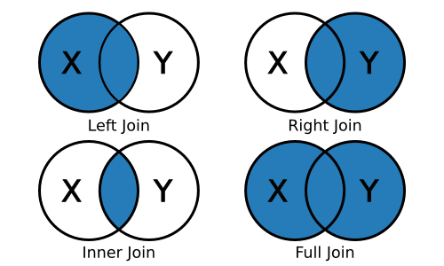

# Töövoo tekitamine

Koodi läbi tekstitöötlust võib kujutada kui teatud töövoogu, mis viib andmed seisust A (toorandmed) seisu B (nt analüüsi tulemus ja graafikud). Selle organiseerimisel on kasulik failis lähtuda samast struktuurist. Faili eesotsas loeme sisse andmed, teeme eeltöötluse, siis analüüsime ja kuvame tulemusi. Sel juhul saame jooksutades tervet faili viia läbi terve analüüsi. Faili sees on aga võimalik teha parandusi ja täiendusi ning teha need töövoo osaks.


## Paketid

```{r}
library(tidyverse)
library(tidytext)
```

## Failide lugemine

Seekord loeme andmetena sisse rohkem kui ühe tekstifaili. Tekstid pärinevad ikka siit: https://datadoi.ee/handle/33/76. map_df() käsu pärast ei pea praegu muretsema. Käsk otsib üles failid kataloogist soned, seob nad omavahel ja siis teeb uue tulba filename.

```{r}
filelist <- list.files("soned",full.names=T)
texts <- map_df(filelist, ~ data_frame(txt = read_lines(.x)) %>%
                  mutate(filename = .x)) %>%
                  mutate(filename= str_remove(filename,"soned/"))

```

Sisu võime vaadata taas muutujat sisse kirjutades.

```{r}

texts

```

Seekord on meil materjale mitmest tekstist. Kasutades count() käsku saame kokku lugeda tekstiread, kus antud juhul oli igal real üks peatükk.

```{r}

texts %>% 
  count(filename)

```

Paremaks ülevaateks võib selliseid asju kuvada.

```{r}

texts %>% 
  count(filename) %>% 
  ggplot(aes(y=filename,x=n))+
  geom_col()

```

## Tekstide eeltöötlus

Nummerdame peatükid ära.

```{r}

texts <- texts %>% 
  group_by(filename) %>% 
  mutate(chapter=row_number())

```

Teeme tekstidest sõnad.

```{r}

words <- texts %>% 
  unnest_tokens(word, txt)


```

Vaatame hetkeks andmestiku sisse.

```{r}

words

```

## Tekstide pikkus

Tuletame meelde, kuidas loendamine toimis. Loendage kokku, mitu sõna on igas failis. Ja kuva see samuti nagu peatükkide arvgi.

```{r}


```


## Sagedusloend

Ja samuti, mitu korda esineb iga sõna ning kuva ka need tulemused.


```{r}


```


## Kuvame

Kuvame levinumad sõnad

```{r}


words %>% 
  count(word,sort=T) %>% 
  filter(row_number()<10) %>% 
  ggplot(aes(x=fct_reorder(word,-n),y=n,fill=fct_reorder(word,-n)))+
  geom_col()

```


## Grupeerimine

Kuidas saame sõnade esinemiskorrad iga teksti sees? Proovi!

```{r}


```


# Filter käsk

Üks sõna erinevates tekstides

```{r}


words %>% 
  group_by(filename) %>% 
  count(word,sort=T) %>% 
  filter(word=="peremees")


```


```{r}


words %>% 
  group_by(filename) %>% 
  count(word,sort=T) %>% 
  filter(word=="töö")


```

Kuidas saame kümme levinumat sõna ühes konkreetses tekstis? Proovi.

```{r}


```


Kuidas saame kümme levinumat sõna igas tekstis? Proovi.

```{r}


```


### Absoluutarv vs sagedus


```{r}
words %>% 
  group_by(filename) %>% 
  count(word,sort=T) %>% 
  mutate(freq=n/sum(n))%>% 
  filter(row_number()<10) %>%  #sort pani need juba õigessejärjekorda
  ggplot(aes(y=word,x=freq,color=filename))+
  geom_point()+
  guides(color=F)


```


Vali välja üks sõna ning kuva selle sagedus eri tekstides

```{r}


```


# Regulaaravaldised

Seni oleme kasutanud filter() käsku täpset võrdsust otsimiseks kahe võrdusmärgiga. R-is on mitmeid vahendeid osalise kattuvuse otsimiseks tekstide puhul. Tidyverse seas on pakett stringr, kus on käsk str_detect().


```{r}

words %>% 
  group_by(filename) %>% 
  count(word,sort=T) 

```


```{r}

words %>% 
  group_by(filename) %>% 
  count(word,sort=T)  %>% 
  mutate(freq=n/sum(n)) %>% 
  filter(str_detect(word,"^hobu"))

```

```{r}

words %>% 
  group_by(filename) %>% 
  count(word,sort=T)  %>% 
  mutate(freq=n/sum(n)) %>% 
  filter(str_detect(word,"^hobu")) %>%
  mutate(freq=sum(freq)) %>% # tekstid on grupeeritud failinime kaupa
  ggplot(aes(y=filename,x=freq))+
  geom_point()

```


```{r}

words %>% 
  group_by(filename) %>% 
  count(word,sort=T)  %>% 
  mutate(freq=n/sum(n)) %>% 
  filter(str_detect(word,"^risti")) %>%
  ungroup() %>% 
  count(word,sort=T)

```

Esialgu on meil sõnad loendatud iga vormi kaupa. Need tuleb meil kokku liita. Selleks on olemas käsk summarise(), mis käitub samamoodi kui mutate(), aga kaotab ära korduvad read ja ebavajalikud tulbad.

```{r}

words %>% 
  group_by(filename) %>% 
  count(word,sort=T)  %>% 
  mutate(freq=n/sum(n)) %>% 
  filter(str_detect(word,"^risti")) %>%
  summarise(freq=sum(freq)) %>% # tekstid on grupeeritud failinime kaupa
  ggplot(aes(y=filename,x=freq))+
  geom_point()

```


Moodusta üks otsing regulaaravaldisega ja kujuta selle tulemust. (Märkus: tabelis on hetkel iga sõna eraldi real, seega ei saa regulaaravaldisega otsida siin kahesõnalisi ühendeid.)

```{r}

```


### Regulaaravaldised uue tulba tegemiseks

Nüüd vaatasime kuidas regulaaravaldisi sai kasutada andmete filtreerimiseks. Neis saab kasutada ka uute muutujate tegemiseks. Kui str_detect() andist TÕENE või VÄÄR vastuse sõnaridade kohta, siis str_extract() võtab uude muutujasse välja kattuva sõnaosa.


```{r}

words %>% 
  group_by(filename) %>% 
  count(word,sort=T)  %>% 
  mutate(freq=n/sum(n)) %>% 
  filter(str_detect(word,"^kirik")|str_detect(word,"^kõrts")) %>%
  ggplot(aes(y=filename,x=freq))+
  geom_point()

```


```{r}

words %>% 
  group_by(filename) %>% 
  count(word,sort=T)  %>% 
  mutate(freq=n/sum(n)) %>% 
  filter(str_detect(word,"^kirik")|str_detect(word,"^kõrts")) %>% 
  ungroup() %>% 
  count(word,sort=T)

```


```{r}

words %>% 
  group_by(filename) %>% 
  count(word,sort=T)  %>% 
  mutate(freq=n/sum(n)) %>% 
  mutate(searchterm=str_extract(word,"^kirik|^kõrts")) %>% 
  group_by(filename,searchterm) %>% 
  #filter(searchterm=="kirik"|searchterm=="kõrts")+
  filter(!is.na(searchterm)) %>%  # kasutame ainult ridu, kus on olemas info searchterm tulbas
  summarise(freq=sum(freq)) %>% # tekstid on grupeeritud failinime kaupa
  ggplot(aes(y=filename,x=freq,color=searchterm))+
  geom_point(alpha=0.5)


```


Moodusta 2-3 otsingut ja kuva nende sagedusi erinevates raamatutes.


```{r}


```


Kitsenda oma sõnaotsingut, nii et me otsime ainult ühe autori teoseid. (Vihje: filter() ja str_detect().

```{r}


```


Näidis ühe teose kohta

```{r}

words %>% 
  group_by(filename) %>% 
  count(word,sort=T)  %>% 
  mutate(freq=n/sum(n)) %>% 
  mutate(searchterm=str_extract(word,"^kirik|^kõrts")) %>% 
  group_by(filename,searchterm) %>% 
  filter(!is.na(searchterm)) %>% 
  summarise(freq=sum(freq)) %>% 
  filter(str_detect(filename,"oigus"))
  

```


# Eeltöötluse täpsustamine

## Sagedased ja vähesagedased sõnad

Proovime anda sõnadele sageduse järgi järjekorranumbrid. Selle jaoks on käsk rank().


```{r}

wordcounts <- words %>% 
  ungroup() %>% 
  count(word,sort=T)%>% 
  mutate(rank=rank(-n))

```

```{r}

wordcounts %>% 
  ggplot(aes(x=rank,y=n))+
  geom_point()+
  scale_y_log10()

```


```{r}

top10000 <-  wordcounts  %>% 
  filter(rank<10000)

```

```{r}

top10000 %>% 
  ggplot(aes(x=rank,y=n))+
  geom_point()+
  scale_y_log10()

```

Kui me tahame nüüd tekstides alles jätta ainult piisavalt sagedad sõnad, tuleks meil kaks tabelit kokku liita. Selleks on Tidyverse pakettides mitmed join() käsud. Ülevaade neist on all (pildilt on puudu anti-join, mis eemaldab kattuvad read).



```{r}
 library(grid)
 grid.newpage(); grid.raster(png::readPNG("joins.png"))
 

```

Pildi peal on kujutatud see ridadehulk, mis alles jääb. Täpsemalt öeldes, left_join() hoiab esimese tabeli terviklikuna. right_join() hoiab teise tabeli terviklikuna. inner_join() hoiab alles ainult kattuvad read. full_join() hoiab mõlemad tabelid terviklikuna. Ning anti_join() eemaldab teise tabeliga kattuvad read esimesest tabelist.

- left_join() - liidab vasakpoolse andmestiku külge need read, mis sobivad paremast.
- right_join() - liidab parempoolse andmestiku külge need read, mis sobivad vasakust.
- inner_join() - jätab alles ainult sobivad read kummastki
- full_join() - jätab alles kõik read mõlemast tabelist, isegi kui ükski ei kattu.
- anti_join() - töötab vastupidiselt ja eemaldab vasakust kõik read, mis ühtivad parempoolse tabeliga.


Praegu oleks meil vaja jätta alles ainult sõnad, mis on ka top sõnade seas. Selleks saame kasutada funktsiooni inner_join()

```{r}

words2 <- words %>% 
  inner_join(top10000,by="word")

```

Leiame nüüd sõnad, mis on sageduselt top 100-s

```{r}


```

## Stopsõnad

Kõige sagedasemad sõnad on enamikes tekstides samasugused ja väga tihti meil neid analüüsi jaoks vaja pole. Selle jaoks on paljudes keeltes tehtud analüüsi mugavuse jaoks stopsõnade nimekirjad. Need on sõnad, mida eemaldada tekstist enne analüüsi. Konkreetse uurimuse puhul tuleks küll kontrollida et niiviisi uurimuse jaoks olulisi sõnu välja ei jäeta.

```{r}

stopwords <- read_lines("uiboaed_stopwords/estonian-stopwords.txt") %>% as_data_frame() %>% rename(word=value)

```

Nüüd saame me kasutada funktsiooni anti_join, kuna me eemaldame neilt vajalikud sõnad.

```{r}

nostopwords <- words %>% 
  anti_join(stopwords)

```


```{r}

wordcounts <- nostopwords %>% 
  group_by(filename) %>% 
  count(word,sort=T)

```


```{r}

wordcounts %>% 
  group_by(filename) %>% 
  arrange(desc(n)) %>% 
  mutate(rank=row_number()) %>% 
  filter(row_number()<10) %>% 
  ggplot(aes(y=filename,x=rank,label=word))+
  geom_text()

```


## Tekstisisendi muutmine

Lisaks str_detect() ja str_extract() käskudele on kasulikud ka str_remove() ja str_replace(). Antud juhul on näiteks paljudes tekstides veel vanale kirjaviisile omaselt kasutusel w v asemel. Meie stopsõnade nimekirjas aga w tähega variante ei ole. Et stopsõnad siin töötaksid, saame asendada lihtsalt kõik w-d v-dega. Nii tuleb sisseküll mõni viga, aga üldjoontes tulemus paraneb.

```{r}

nostopwords <- words %>% 
  mutate(word=str_replace_all(word,"w","v")) %>% 
  anti_join(stopwords)

  
```


```{r}

wordcounts <- nostopwords %>% 
  group_by(filename) %>% 
  count(word,sort=T)

```


```{r}

wordcounts %>% 
  group_by(filename) %>% 
  arrange(desc(n)) %>% 
  mutate(rank=row_number()) %>% 
  filter(row_number()<10) %>% 
  ggplot(aes(y=filename,x=rank,label=word))+
  geom_text()

```


## Andmete kõrvalejätmine käsitsi

Väga paljud sagedastest mitte-stopsõnadest on tegelaste nimed. Võtame ühe teose, kus on esikohal nimed ning eemaldame need käsitsi sealt. Trükime uuesti välja vastused. Mis näha on?

```{r}


```


# Kodutöö

Siin on mõned harjutused tehtu kinnistamiseks. Proovi ära teha vähemalt 4 7-st ülesandest.


1. Vali välja üks teos tänasest komplektist. Loe see fail sisse ja nummerda peatükid.

```{r}


```


2. Tee tekstiväljadest sõnaväljad, salvesta iga sõna juures asukohainfo.

```{r}


```


3. Vali välja kolm sõna ning kuva nende asukohad teoses

```{r}


```


4. Arvuta välja nende kolme sõna sagedused igas peatükis.

```{r}


```


5. Otsi kolme terminit regulaaravaldiste abil nii, et eri käändevormid ja tuletised satuksid samale kujule. Kuva nende asukohad tekstis.

```{r}


```


6. Loe kokku vastete sagedused tekstis.

```{r}


```


7. Võta kokku 10 kõige sagedasemat sõna ning esita nende sagedused kolmes vabalt valitud teoses.

```{r}


```


